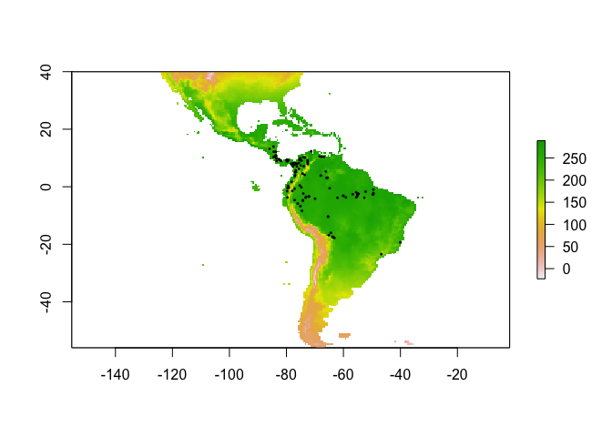
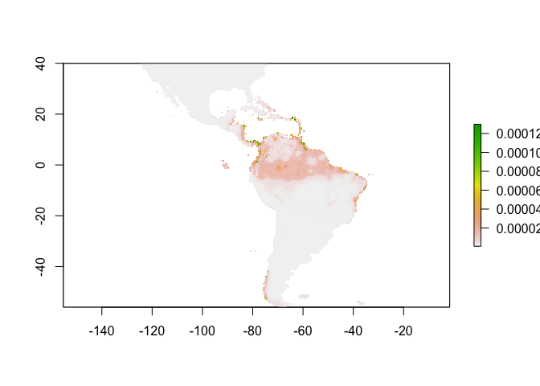
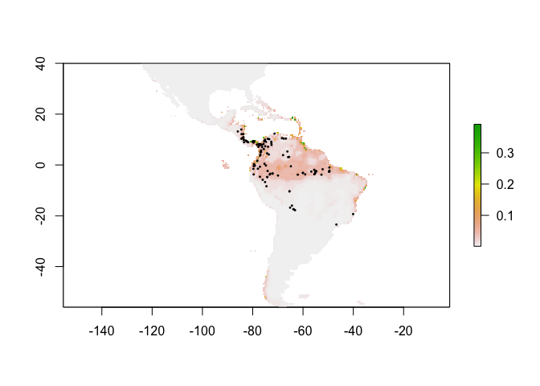

ppmify
======

### convert your Poisson regression into a Poisson point process model

[](https://travis-ci.org/goldingn/ppmify) [](https://codecov.io/github/goldingn/ppmify) [](http://cran.rstudio.com/web/packages/ppmify)

**package under construction - not ready to use just yet!**


**ppmify** (i.e. ppm-ify, pronounced *p-p-m-if-eye*? never mind...) is a micropackage to help set up Poisson point process models (PPMs) for point data. PPMs can be fitted using standard software for Poisson regression, after a little bit of fiddling with the data (adding integration points as pseudo-observations and calculating integration weights). This process isn't too difficult to do manually, but can be a bit boring, so why bother?

The function `ppmify()` takes the data needed for fitting a PPM, does this fiddling for you, and then returns a dataframe-like object that you can use in your favourite Poisson modelling software. That could be GLM, a generalised boosted model (AKA boosted regression tree), elasticnet regression, Gaussian process regression or whatever. At some point in the future it should be able to set up slightly more complex integration methods, PPMs with known spatial reporting biases, PPMs with attraction/repulsion between points, and possibly even multi-species PPMs - watch this space!

However, this isn't an end-to end solution. Once `ppmify()` has handed over the processed data, it's up to the user to fit the Poisson model in the right way. We'll provide some guidance here, but would advise users to familiarise themselves with PPMs and this modelling approach first.

### Installation

You can install ppmify directly from GitHub using the devtools package:

``` r
devtools::install_github('goldingn/ppmify')
library(ppmify)
```

(If you're a windows user, you may need to install [RTools](https://cran.r-project.org/bin/windows/Rtools/) first to use this `devtools` function)

### ppmifying things

Here's an example of a Boosted regression tree (generalised boosted model) PPM species distribution model fitted to a presence-only species distribution dataset:

First we load an example dataset contained in the `dismo` R package (install this first if it's not already installed):

``` r
bradypus <- read.csv(paste0(system.file(package="dismo"),
                            "/ex/bradypus.csv"))[, -1]
covariates <- stack(list.files(paste0(system.file(package="dismo"), '/ex'),
                               pattern='grd', full.names=TRUE))

plot(covariates[[1]])
points(bradypus, pch = 16, cex = 0.4)
```

<!-- -->

Next, we run ppmify on the point data with quadrature on a regular grid, specifying the area of interest (one of the covariates), the stack of covariates to use, and the density of integration points we want (in points per square km):

``` r
ppm <- ppmify(bradypus,
              area = covariates[[1]],
              covariates = covariates,
              density = 1 / 100,
              method = 'grid')
```

Next, we can load the gbm R package and fit a PPM BRT. The key points to remember are: *use a poisson likelihood* and *use the weights column as a log-offset*:

``` r
# fit a BRT PPM SDM, OMG.
library(gbm)
m <- gbm(points ~ offset(log(weights)) +
           bio1 +
           bio5 +
           bio6 +
           bio7 +
           bio8,
         data = ppm,
         n.trees = 10000,
         cv.folds = 5,
         distribution = 'poisson')
```

Next we pick the optimal number of trees (a gbm step to prevent overfitting) and make predictions using the raster-friendly predict function in the raster package. When predicting we need to remember to: *provide a weights argument* (so that `raster::predict` can do it's thing) and *predict on the response scale* to get the expected number of points per unit area:

``` r
# optimal number of trees
trees <- gbm.perf(m, plot.it = FALSE, method = 'cv')

# predict to a raster
p <- predict(covariates, m,
             type = 'response',
             const = data.frame(weights = 1),
             n.trees = trees)

# and plot
plot(p)
```

<!-- -->

(actually gbm refuses to apply the offset, even though we provide it, so for this type of model the `const` argument isn't necessary - normally it is though)

`ppmify()` works in square kilometres, so the units in `p` are the expected number of points per square kilometre. We can instead calculate the expected number of points per cell by multipling by the area of each cell (these are lat-longs, so the cell area increases further from the equator):

``` r
p_cell <- area(p) * p
plot(p_cell)
points(bradypus, pch = 16, cex = 0.4)
```

<!-- -->

We can then calculate the expected number of points predicted by the model and compare it to the number it was fitted to

``` r
cellStats(p_cell, sum)
```

    ## [1] 118.1604

``` r
nrow(bradypus)
```

    ## [1] 116

Pretty cool.
